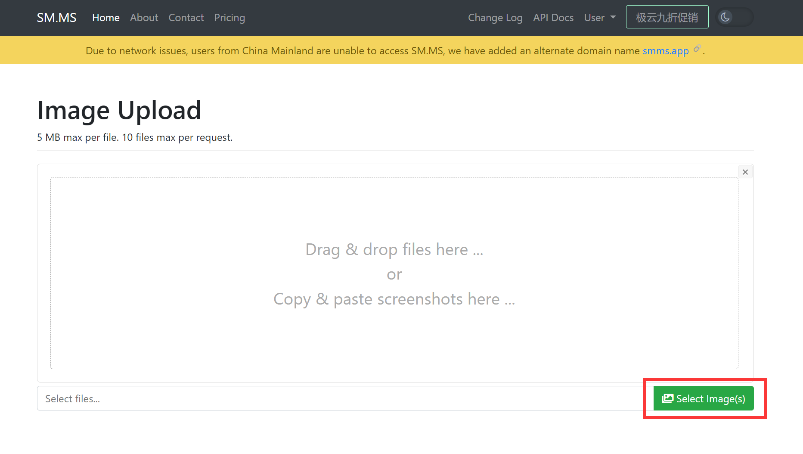
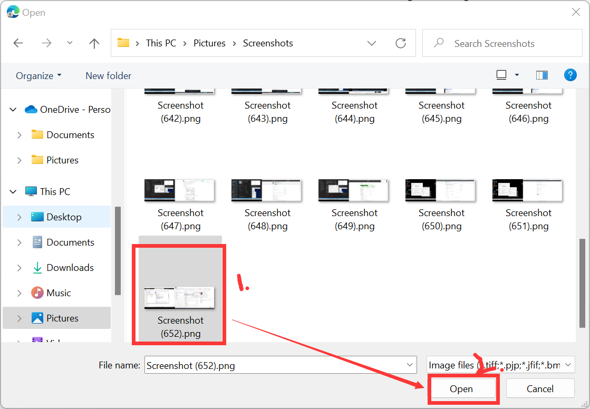
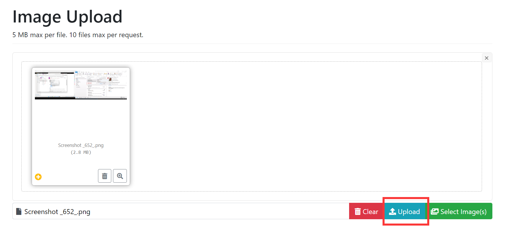
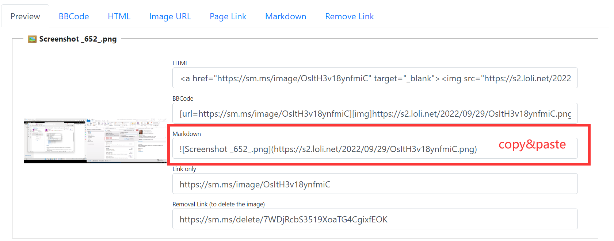

# Markdown Guide

In this guide, Vscode is used to edit the markdown files.

## References: 

* [Markdown Guide](https://www.markdownguide.org/)

## Basic Syntax

### Overview

> In this part, the basic syntax of Headings, Paragraphs, Line Breaks, Emphasis, Blockquote, Lists, Code, Horizontal Rules, Images, Escaping Characters, HTML will be introduced.

### Headings

> To create a heading, add number signs (#) in front of a word or phrase. The number of number signs you use should correspond to the heading level. For example, to create a heading level three (\<h3\>), use three number signs (e.g., \#\#\# My Header).

| Markdown | HTML | Rendered Output |
| ----------- | ----------- | ----------- |
| \# Heading level 1 | \<h1>Heading level 1\</h1> | <h1>Heading level 1</h1> |
| \#\# Heading level 2 | \<h2>Heading level 2\</h2> | <h2>Heading level 2</h2> |
| \#\#\# Heading level 3 | \<h3>Heading level 3\</h3> | <h3>Heading level 3</h3> |
| \#\#\#\# Heading level 4 | \<h4>Heading level 4\</h4> | <h4>Heading level 4</h4> |
| \#\#\#\#\# Heading level 5 | \<h5>Heading level 5\</h5> | <h5>Heading level 5</h5> |
| \#\#\#\#\#\# Heading level 6 | \<h6>Heading level 6\</h6> | <h6>Heading level 6</h6> |

* Alternate Syntax: <br>
You can see there is a line below Heading level 1 and level 2.

* Attention: 
<br>
Between '#' and the text, a space should not be missing (e.g., #\<space\>Heading). 
<br>
You should also put blank lines before and after a heading for compatibility.
    <br>
    ```
    # Heading
    <br>
    ... and after a heading.
    ```

### Paragraphs

> To create paragraphs, use a blank line to separate one or more lines of text.

Just 'Enter'.

```
Paragraph 1.

Paragraph 2.
```

Or 

Print '\<br\>' between two paragraphs.

```
Paragraph 1.
<br>
Paragraph 2.
```

* Attention: <br>
Don't put tabs or spaces in front of your paragraphs. Keep lines left-aligned.

### Line Breaks

> To create a line break or new line (\<br\>), end a line with two or more spaces, and then type return.

```
The first line. ('Enter')
The second line.
```

Or

```
The first line. <br>
The second line.
```

### Emphasis

1. Bold

    | Markdown | HTML | Rendered Output |
    | ----------- | ----------- | ----------- |
    | I just love \*\*bold text\*\*. | 	I just love \<strong\>bold text\</strong\>. | I just love **bold text**. |
    | I just love \_\_bold text\_\_. | 	I just love \<strong\>bold text\</strong\>. | I just love __bold text__. |
    | Love**is**bold | 	Love\<strong\>is\</strong\>bold | Love**is**bold |

    * Attention: <br>
    Don't do this below: 
    <br>
    `Love__is__bold`
<br>
2. Italic

    | Markdown | HTML | Rendered Output |
    | ----------- | ----------- | ----------- |
    | Italicized text is the \*cat's meow\*. | Italicized text is the \<em\>cat's meow\</em\>. | Italicized text is the *cat’s meow*. |
    | Italicized text is the \_cat's meow\_. | 	I just love \<em\>bold text\</em\>. | Italicized text is the _cat's meow_. |
    | A\*cat\*meow | A\<em\>cat\</em\>meow | A*cat*meow | 

    * Attention: <br>
    Cannot do this below: 
    <br>
    `A__cat__meow`  
<br>
3. Bold and Italic

    Do this below: <br>
    `This text is ***really important***.`

    Don't do this below: <br>
    `This is really___very___important text.`
<br>

### Blockquotes

1. Basic Blockquotes

    > To create a blockquote, add a '>' in front of a paragraph. 

    | Markdown |
    | ----------- |
    \> Dorothy. 

    | Rendered Output |
    | ----------- |
    > Dorothy. 
<br>

2. Blockquotes with Multiple Paragraphs

    | Markdown |
    | ----------- |
    \> Dorothy. <br> \> The Witch.

    | Rendered Output |
    | ----------- |
    > Dorothy. 
    > 
    > The Witch.
<br>

3. Nested Blockquotes

    | Markdown |
    | ----------- |
    \> Dorothy. <br> \> <br> \>\> The Witch.

    | Rendered Output |
    | ----------- |
    > Dorothy. 
    > 
    > > The Witch.

4. Blockquotes with Other Elements

    | Markdown |
    | ----------- |
    \> #### The quarterly results look great! <br> \>  <br> \> - Revenue was off the chart. <br> \> - Profits were higher than ever. <br> \> <br> \>  *Everything* is going according to **plan**.

    | Rendered Output |
    | ----------- |
    > #### The quarterly results look great!
    >
    > - Revenue was off the chart.
    > - Profits were higher than ever.
    >
    >  *Everything* is going according to **plan**.

### Lists

1. Ordered Lists

    | Markdown |
    | ----------- | 
    | 1. First item <br> 2. Second item <br> 3. Third item <br> 4. Fourth item <br> |

    | HTML |
    | ----------- | 
    ```
    <ol>
        <li>First item</li>
        <li>Second item</li>
        <li>Third item</li>
        <li>Fourth item</li>
    </ol>
    ```
    
    | Rendered Output |
    | ----------- |
    1. First item
    2. Second item
    3. Third item
    4. Fourth item  

2. Unordered Lists

    | Markdown |
    | ----------- | 
    | * First item <br> * Second item <br> * Third item <br> * Fourth item <br> |

    | HTML |
    | ----------- | 
    ```
    <ul>
        <li>First item</li>
        <li>Second item</li>
        <li>Third item</li>
        <li>Fourth item</li>
    </ul>
    ```
    
    | Rendered Output |
    | ----------- |
    * First item
    * Second item
    * Third item
    * Fourth item

### Code

| Markdown | Rendered Output |
| ----------- | ----------- |
| \`Open the file.\` | `Open the file.` |

### Code Blocks

\`\`\`Open the file.\`\`\` >
```
Open the file.
```

### Images

| Markdown |
| ----------- |
 \!\[\<ImageName\>\]\(\<ImagePath\>\)

| Rendered Output |
| ----------- |


* Attention: <br>
    With Vscode, hover on an image, drag it to where you want to add and hold 'shift' to generate an image link like the below.
    ```
    
    ```
    With Image Hosting as [SM.MS](https://sm.ms/), click on 'Select Images' button, select the image that you want to generate the image link and copy&paste the 'Markdown Link' to where you want to add. 
    <br>
    > Step 1. 
    >
    > Step 2. 
    >
    > Step 3. 
    >
    > Step 4. 

### Horizontal Rules

> To create a horizontal rule, use three or more asterisks (***), dashes (---), or underscores (___) on a line by themselves.

| Markdown |
| ----------- |
\*\*\* <br> \-\-\- <br> \_\_\_


| Rendered Output |
| ----------- |
***
---
___

### Links

| Markdown | HTML | Rendered Output |
| ----------- | ----------- | ----------- |
| \[\<LinkName\>\]\(\<LinkPath\>\) | \<a href="https://www.markdownguide.org"\>Markdown Guide\</a\> | [Markdown Guide](https://www.markdownguide.org) |

### 


